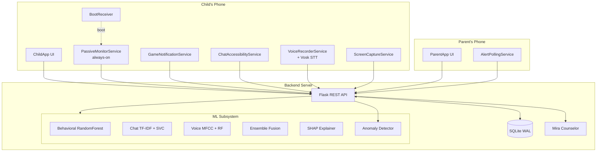
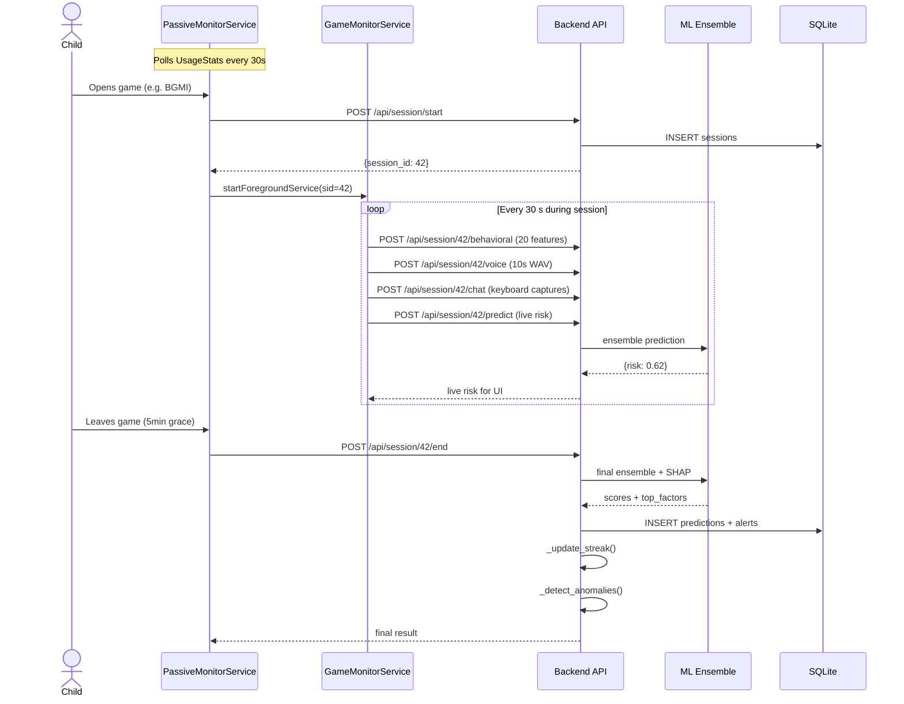
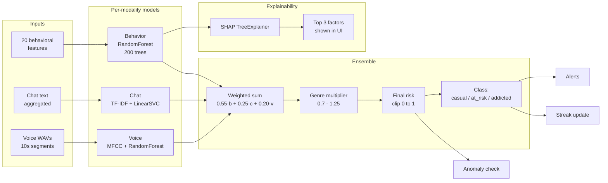

# Architecture Diagrams

Three views of the system architecture, in increasing detail.

---

## View 1 — Component diagram (high level)



---

## View 2 — Data flow (end-to-end session)



---

## View 3 — ML ensemble internals



---

## ASCII Fallback (for plain-text contexts)

```
                 ┌──────────────────────────────────────────────────────┐
                 │              CHILD'S PHONE (ChildApp)                │
                 │                                                      │
                 │  ┌────────────────────────────────────────────────┐  │
                 │  │ PassiveMonitorService  ──  UsageStats polling  │  │
                 │  │ GameNotificationService ── notif craving       │  │
                 │  │ ChatAccessibilityService ── keyboard capture   │  │
                 │  │ VoiceRecorderService  ── Vosk STT + 10s WAVs   │  │
                 │  │ ScreenCaptureService  ── behavior snapshots    │  │
                 │  └────────────────┬───────────────────────────────┘  │
                 └───────────────────┼──────────────────────────────────┘
                                     │
                                     │  HTTP (Retrofit)
                                     ▼
                 ┌──────────────────────────────────────────────────────┐
                 │             BACKEND (Flask, port 5000)               │
                 │                                                      │
                 │   ┌────────────────────────────────────────────┐     │
                 │   │           REST API (40+ endpoints)         │     │
                 │   └─────────────┬──────────────────────────────┘     │
                 │                 │                                    │
                 │     ┌───────────┼──────────────┬──────────────┐      │
                 │     ▼           ▼              ▼              ▼      │
                 │  ┌──────┐  ┌─────────┐  ┌──────────┐  ┌───────────┐  │
                 │  │ ML   │  │ SHAP    │  │ Anomaly  │  │ Mira AI   │  │
                 │  │ 3-mod│  │ explain │  │ z-score  │  │ counselor │  │
                 │  └──┬───┘  └────┬────┘  └────┬─────┘  └─────┬─────┘  │
                 │     │           │            │              │        │
                 │     └───────────┴────────────┴──────────────┘        │
                 │                       │                              │
                 │              ┌────────▼─────────┐                    │
                 │              │  SQLite (WAL)    │                    │
                 │              │  13 tables       │                    │
                 │              └──────────────────┘                    │
                 └─────────────────▲────────────────────────────────────┘
                                   │
                                   │  HTTP (Retrofit)
                                   │
                 ┌─────────────────┴──────────────────────────────────┐
                 │            PARENT'S PHONE (ParentApp)              │
                 │                                                    │
                 │   Dashboard · Alerts · Recommendations · PDF       │
                 │   Multi-child switcher · time-limit control        │
                 └────────────────────────────────────────────────────┘
```
