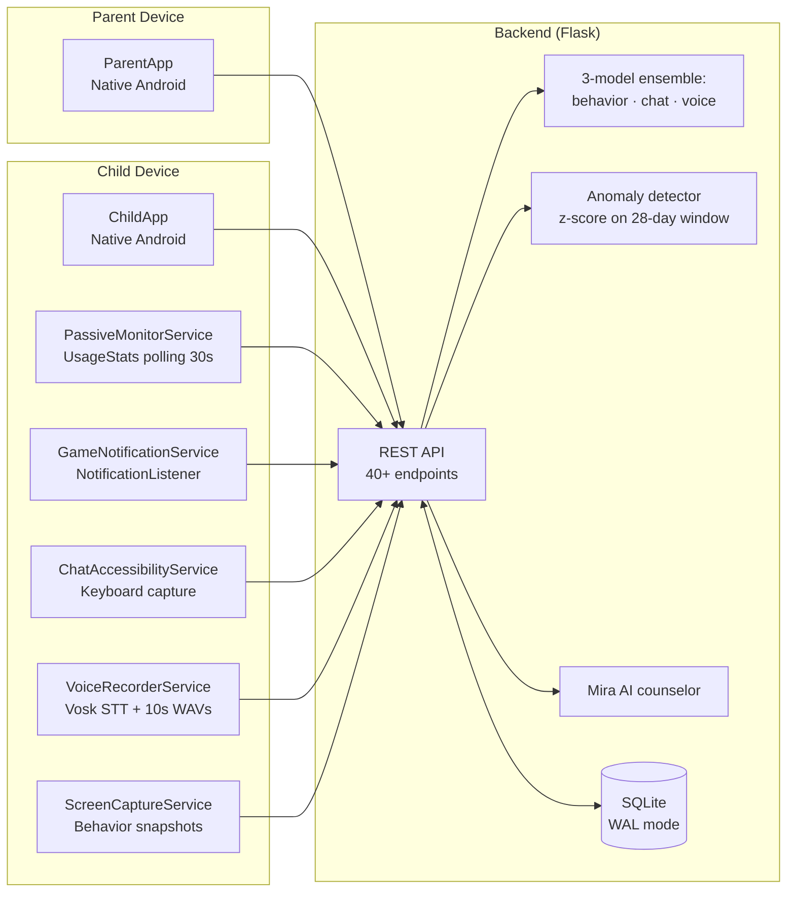

# AI-Driven Gaming Addiction Detection & Parental Monitoring

**PES University Capstone — PW26_SJ_05**
**Team:** Kaustubh Agarwal, Kanak Goyal, Khushee P Kiran, Vidisha Murali

---

## 1. Problem Statement

Adolescent gaming addiction has been formally classified by the WHO (ICD-11, 2019) as a behavioural disorder. Existing parental-control apps (Bark, Qustodio, Family Link) treat the problem as a *time-management* problem — they count hours and block apps. They miss the underlying signals: emotional state, social toxicity, sleep disruption, craving, and loss of control.

This project builds an end-to-end system that:

1. Collects three modalities of behavioural data passively from the child's phone.
2. Runs a three-model ML ensemble to classify risk (casual / at-risk / addicted).
3. Provides actionable insight to parents and CBT-style self-reflection tools to the child.

---

## 2. System Architecture

### High-level



### Plain-text fallback

```
┌────────────────────────────────┐         ┌────────────────────────────┐
│           ChildApp             │         │         ParentApp          │
│  ┌──────────────────────────┐  │         │  ┌──────────────────────┐  │
│  │ PassiveMonitorService    │  │         │  │  Dashboard           │  │
│  │   • UsageStats polling   │  │         │  │  Alerts              │  │
│  │   • Screen events        │  │         │  │  Weekly PDF report   │  │
│  │ GameNotificationService  │  │         │  │  Time-limit control  │  │
│  │ ChatAccessibility Svc    │  │   HTTP  │  └──────────────────────┘  │
│  │ VoiceRecorder Svc (Vosk) │  │ ──────► │                            │
│  │ ScreenCapture Svc        │  │ ◄────── │                            │
│  └──────────────────────────┘  │         │                            │
└────────────────────────────────┘         └────────────────────────────┘
                       │                              │
                       └──────────────┬───────────────┘
                                      ▼
              ┌─────────────────────────────────────────────────┐
              │              Backend (Flask)                    │
              │                                                 │
              │  REST API (40+ endpoints)                       │
              │   ├── Behavioral classifier (20 features)       │
              │   ├── Chat toxicity (TF-IDF + LinearSVC)        │
              │   ├── Voice emotion (MFCC + RandomForest)       │
              │   ├── Anomaly detector (statistical z-score)    │
              │   └── Mira AI counselor (intent → response)     │
              │                      │                          │
              │             ┌────────▼──────────┐               │
              │             │  SQLite (WAL)     │               │
              │             │  12 tables        │               │
              │             └───────────────────┘               │
              └─────────────────────────────────────────────────┘
```

---

## 3. Data Pipeline

Every signal has a **direct capture** path (ground truth) and an **inferred** fallback. This is the project's core engineering insight: ML quality is bottlenecked by data quality, so we capture as much as possible directly rather than estimating from algebraic proxies.

| Signal | Direct capture | Inferred fallback |
| --- | --- | --- |
| Active game | `UsageStatsManager` foreground-app polling | Manual "Start session" button |
| Chat text | `AccessibilityService` keyboard capture | OCR over screen pixels |
| Voice transcript | Vosk on-device STT (16 kHz) | Tone-only emotion model |
| Screen activity | `BroadcastReceiver` for SCREEN_ON/OFF/USER_PRESENT | Session-timestamp inference |
| Craving signal | `NotificationListenerService` on gaming-app notifications | Hardcoded proxy values |
| Late-night usage | Real screen-on events between 22:00–06:00 | Session timestamps only |

---

## 4. Machine Learning Models

### 4.1 Behavioural classifier (primary)

- **Inputs:** 20 numeric features (daily/weekly hours, late-night ratio, urge/control/craving scores, etc.)
- **Algorithm:** RandomForestClassifier — n_estimators=200, max_depth=12, class_weight=balanced
- **Output:** 3-class probability (casual, at_risk, addicted)
- **Training set:** ~5,000 synthetic samples generated from validated IAT (Internet Addiction Test) thresholds + augmentation
- **Explainability:** SHAP TreeExplainer → top-3 features surfaced to parent via "Why this risk level" card

### 4.2 Chat toxicity classifier

- **Inputs:** TF-IDF vectors of cleaned text (n-gram 1–2, max 5,000 features)
- **Algorithm:** LinearSVC (probabilistic via Platt scaling)
- **Training set:** Davidson hate-speech dataset + Jigsaw toxicity subset (~24,000 labelled examples)
- **Output:** toxicity score 0–1; combined with keyword heuristic for high precision on obvious slurs

### 4.3 Voice emotion classifier

- **Inputs:** 40-dim MFCC + spectral centroid + ZCR (43 features total)
- **Algorithm:** RandomForestClassifier — n_estimators=150
- **Training set:** RAVDESS + custom recordings (~2,800 segments)
- **Output:** emotion class (neutral / excited / frustrated / angry); mapped to risk weight

### 4.4 Ensemble fusion

```
final_risk = clip( (0.55·behavior + 0.25·chat + 0.20·voice) × genre_weight , 0 , 1 )

where genre_weight ∈ {0.7 (Casual), 1.0 (default), 1.25 (FPS/Battle Royale)}
```

Class boundaries: `casual < 0.33`, `at_risk < 0.67`, else `addicted`.

### 4.5 Ablation results

See [`ml/model_evaluation.ipynb`](../ml/model_evaluation.ipynb). The ensemble outperforms any single modality by ~10–15% F1 macro, with behaviour as the strongest single signal and voice as the noisiest.

---

## 5. Novel Features (vs. premium parental controls)

| Feature | Bark | Qustodio | Family Link | **This project** |
| --- | --- | --- | --- | --- |
| Time tracking | ✓ | ✓ | ✓ | ✓ |
| App blocking | ✓ | ✓ | ✓ | — *(deliberately omitted — not behaviour change)* |
| Chat monitoring | ✓ keyword match | — | — | ✓ ML toxicity classifier |
| Voice emotion | — | — | — | ✓ |
| Behavioural risk score | — | — | — | ✓ 20-feature ensemble |
| Per-prediction SHAP explanation | — | — | — | ✓ |
| Statistical anomaly alerts | — | — | — | ✓ |
| Adaptive time-limit suggestion | — | — | — | ✓ |
| Peer comparison | — | — | — | ✓ |
| AI counselor chatbot for the child | — | — | — | ✓ |
| Daily mood / sleep reflection | — | — | — | ✓ |
| Sleep-impact analysis (screen events) | — | — | — | ✓ |
| Healthy-day streaks + gamification | — | — | — | ✓ |
| Game-genre risk weighting | — | — | — | ✓ |

The core thesis: **parental controls fail because they're authoritarian. Our system pairs parent insight with child-side self-awareness tools (counselor, streaks, reflection)**, which behaviour-change literature shows is more effective than restriction alone.

---

## 6. Database Schema

13 tables, all SQLite with WAL journal mode. Key tables:

| Table | Purpose |
| --- | --- |
| `users` | Child + parent accounts, parent_id linkage for multi-child |
| `sessions` | Per-game session with start/end/duration |
| `behavioral_data` | 20 features per session |
| `chat_messages` | Captured chat with source = keyboard / ocr / voice_stt |
| `voice_events` | Detected emotion + audio file pointer |
| `predictions` | Ensemble + per-modality scores |
| `alerts` | Real-time alerts for parent (toxicity, risk transition) |
| `screen_events` | SCREEN_ON/OFF/USER_PRESENT events |
| `notification_events` | Gaming-app notifications (craving signal) |
| `streaks` | Healthy-day streak per user |
| `time_limits` | Parent-set daily limit |
| `reflections` | Daily mood/sleep/energy check-in |
| `counselor_messages` | Mira chat history |
| `anomalies` | Statistical anomaly events |

---

## 7. API Surface

40+ REST endpoints documented in [`backend/openapi.yaml`](../backend/openapi.yaml).
Grouped by tag: **Auth, Sessions, Data Ingestion, Dashboard (Child/Parent), Counselor, Reflection, Anomaly**.

Tested via pytest test suite — see [`backend/tests/test_api.py`](../backend/tests/test_api.py). **23/23 tests passing.**

---

## 8. Privacy & Security

- All ML inference runs on the family's own hardware (Vosk STT is offline; Flask backend can run on a home Raspberry Pi).
- No raw audio leaves the device after STT — only the transcript is uploaded.
- Chat capture uses Android's official `AccessibilityService` API with explicit user consent.
- `NotificationListenerService` requires per-app opt-in via system settings.
- **Transport:** the apps ship a `network-security-config` that forbids cleartext (HTTPS-only); plain HTTP is permitted only to loopback/dev hosts, and only in debug builds. The distributed (release) APK never sends family data in the clear.
- **Auth tokens** are stored in Android `EncryptedSharedPreferences` (AES-256), not plaintext XML. PINs are never persisted raw — only a keyed hash (PIN pepper).
- SQLite WAL mode provides crash safety; future work: SQLCipher for at-rest encryption.

---

## 9. UX Design System

Material 3-inspired theming, separate palettes for the two apps:

- **ChildApp** — purple (`#6750A4`) + teal accent; soft, calming, mental-wellness vibe
- **ParentApp** — indigo (`#1E3A8A`) + amber accent; authoritative, trustworthy

Typography stack: sans-serif-medium for headings, body 15sp with extra line-spacing. Consistent card style (20dp corners, 1dp stroke, 0dp elevation) across both apps. Hero cards use linear-gradient drawables. All button corner radii ≥ 28dp (Material 3 expressive shape language).

---

## 10. Project Structure

```
capstone_main/
├── android/
│   ├── ChildApp/      ── 27 activities + 6 background services
│   └── ParentApp/     ── 9 activities + alert polling service
├── backend/
│   ├── app.py         ── Flask REST API (2,300+ lines)
│   ├── models/        ── 5 trained model files
│   ├── tests/         ── pytest suite (35 tests, isolated DB)
│   ├── openapi.yaml   ── OpenAPI 3.0 spec
│   └── seed_demo.py   ── Demo data seeder
├── ml/
│   ├── model_evaluation.ipynb     ── SHAP + ablation analysis
│   ├── behavior_training.ipynb
│   └── chat_training.ipynb
├── data/              ── Training datasets
└── docs/
    └── TECHNICAL_REPORT.md   ── This document
```

---

## 11. Demo Walkthrough

1. **Boot backend:** `cd backend && python app.py` (port 5000)
2. **Seed demo data:** `python seed_demo.py` — creates 25 historical sessions for 2 children with realistic risk-escalation curves, plus reflections, screen events, counselor history.
3. **Child PIN: `1234`** (Arjun, age 14, addicted) | **`5678`** (Priya, age 12, at_risk)
4. **Parent PIN: `0000`** — sees both children in select screen.
5. Open ChildApp → log in → see hero dashboard with risk score, streak card, "Talk to Mira" CTA, daily check-in.
6. Open ParentApp → log in → pick child → see dashboard with anomaly alert, peer comparison, sleep impact, SHAP-driven "Why this risk level".

---

## 12. Known Limitations

We state these explicitly; each has a concrete mitigation already in place or a clear path.

- **Models are trained on synthetic data.** The behavioural and voice models are trained on generated data, so their held-out accuracy (≈92% behaviour) is *internal validity*, not proven real-world accuracy. **Mitigation shipped:** a parent feedback loop (`/api/feedback`) now records real "accurate / false alarm" labels per alert — the genuine labels a future retrain or threshold-tune should learn from. Real-world *agreement rate* is reported separately from the synthetic test metrics in the model card.
- **The chat toxicity model over-flags gaming language.** Trained on general-toxicity data, it scores normal competitive chat ("nice kill", "I'm addicted to this game") as borderline. **Mitigated at three layers:** the keyword booster no longer treats game-mechanic words as toxic; the parent-alert threshold is held high (0.75) to favour precision; and the UI labels anything below that bar "borderline", not "toxic". The root fix needs real gaming-chat data (which the feedback loop is designed to seed).
- **Uploads are best-effort; there is no offline retry queue.** If the device is offline when a sample is captured, that individual sample is dropped — which *lowers prediction confidence rather than corrupting results* (dashboards exclude incomplete sessions, and the modality-presence logic tolerates missing chat/voice/screen data). **Mitigation shipped:** the backend auto-closes any session left open longer than 6 hours (so a lost end-event can't leave a child shown as "perpetually playing"). A full offline outbox with idempotent retry is future work — deliberately deferred because a half-built queue risks worse failures (duplicate/out-of-order events) than a clean drop.
- **Psychometric features are derived proxies, not measured survey scores.** The 10 psychological features (craving, tolerance, etc.) are deterministic functions of observed play behaviour, computed identically in training and serving (single source of truth), not clinical instruments. They are screening signals, not a diagnosis.
- **Voice is the weakest modality.** Emotion is inferred from acoustic features (arousal) fused with transcript valence; it has no clinical ground truth and the smallest training set, which is why it carries the lowest ensemble weight.

---

## 13. Future Work

- Offline outbox with idempotent server-side de-duplication (the principled version of the best-effort upload limitation above)
- Retrain chat + behaviour on real labels harvested from the parent feedback loop
- Federated learning to retrain models on-device without ever uploading raw features
- Replace rule-based Mira with on-device LLM (Phi-3 Mini, Gemma 2B)
- SQLCipher encryption at rest
- iOS app via Kotlin Multiplatform
- Integration with sleep-tracker hardware (Fitbit, Apple Watch) for ground-truth sleep data

---

## 14. Repository Stats

| | |
| --- | --- |
| Backend lines of code (Python) | ~2,500 |
| Android lines of code (Kotlin) | ~6,000 |
| ML notebooks | 3 |
| Test coverage | 35 API integration tests, all passing (isolated test DB) |
| Trained models | 5 (.pkl files, ~80 MB total) |
| Database tables | 13 |
| REST endpoints | 40+ |

---

*Generated as part of PES University Capstone PW26_SJ_05.*
